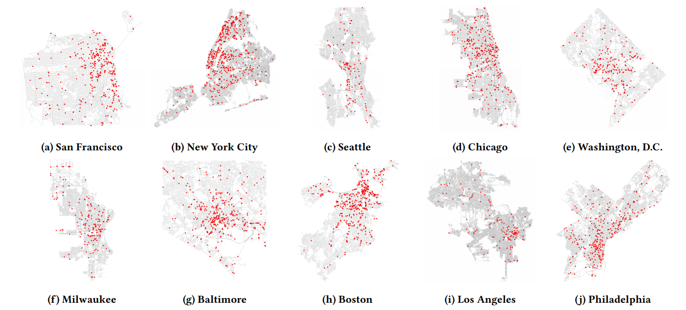

# Surveilling Surveillance: Estimating the Prevalence of Surveillance Cameras with Street View Data
### [Project page](https://policylab.stanford.edu/surveillance/) |   [Paper](https://arxiv.org/abs/2105.01764)


__Locations of verified cameras in 10 large U.S. cities for the period 2016–2020. Densely clustered areas of points indicate regions with high camera density in each city. Camera density varies widely between neighborhoods. Note: Scale varies
between cities.__

This is the code base of the [Surveillance Camera](https://arxiv.org/abs/2105.01764) paper:
```
@article{sheng2021surveilling,
  title={Surveilling Surveillance: Estimating the Prevalence of Surveillance Cameras with Street View Data},
  author={Sheng, Hao and Yao, Keniel and Goel, Sharad},
  journal={arXiv e-prints},
  pages={arXiv--2105},
  year={2021}
}
```

## Camera Detection
### Requirements
- Linux or macOS with Python ≥ 3.6
- [PyTorch](https://pytorch.org/) ≥ 1.6 and [torchvision](https://github.com/pytorch/vision/) that matches the PyTorch installation. Install them together at [pytorch.org](https://pytorch.org/) to make sure of this
- [Detection2](https://github.com/facebookresearch/detectron2). The installation instruction of Detection2 can be found [here](https://detectron2.readthedocs.io/en/latest/tutorials/install.html)

Install Python dependencies by running:
```shell
pip install -r requirements.txt
```

### Download street-view images
```shell
python main.py download_streetview_image --key GOOGLE_API_KEY --sec GOOGLE_API_SECRET
```

### Model training
```shell
cd detection && python main.py train --exp_name EXPERIMENT_NAME --[hyparameter] [value]
```

### Model inference
```shell
cd detection && python main.py test --deploy --deploy_meta_path [DEPLOY_META_PATH]
```
, where `DEPLOY_META_PATH` is a path to a csv file of the following format:

| save_path | panoid | heading | downloaded |
| --------- | ------ | ------- | ---------- |
| /dY/5I/l8/4NW89-ChFSP71GiA/344.png | dY5Il84NW89-ChFSP71GiA | -105.55188877562128 | True | 
| ... | | |

Here, `panoid` and `heading` refer to the ID and heading of each street-view image. 


## Analysis
To reproduce the figures and tables in our paper, run the `analysis/results.Rmd` script. 

You'll need to download our camera and road network data [available here](https://storage.googleapis.com/scpl-surveillance/camera-data.zip) into a `data` directory in the root of this repository.

## Artifacts

### Annotations

Our collected camera annotations can be downloaded as follows:

| #images | # cameras   | link | md5 |
| ------- | :---------: | ---- | --- |
| 3,155    | 1,696      | [download](https://storage.googleapis.com/scpl-surveillance/meta.csv) | `b2340143c6af2d1e6bfefd5001fd94c1` |

- *2021-5-20: This dataset is larger than the one reported in the paper as we include verified examples from our pilot.*
- *2021-5-18: The metadata can also be found in this repo as `./data/meta.csv`*. 

### Pre-trained Models

Our pre-trained camera detection model can be downloaded as follows:

| architecture  | Size  | link         | md5 |
| ------------  | ----- | ----         | --- |
| FasterRCNN    | 472 Mb| [download](https://storage.googleapis.com/scpl-surveillance/model.zip) | `dba44ad36340d3291102e72b340568a0` |

- *2021-5-20: We updated the model architecture (FasterRCNN).*

### Detection and Road Network Data

| Size  | link         | md5 |
| ----- | ----         | --- |
| 97 Mb| [download](https://storage.googleapis.com/scpl-surveillance/camera-data.zip) | `6ceab577c53ba8dbe60b0ff1c8d5069a` |
